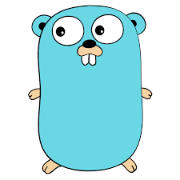

  
<!-- Banner image -->

# Ignacio Padrón
*System Administrator on a journey to become a Site Reliability Engineer (SRE)*

## Introduction

Hello there! I'm **Ignacio Padrón**, a System Administrator from Málaga, Spain. I'm currently interning at **Freepik** (yes, that awesome site for free vectors and photos!) where I'm sharpening my skills in systems and reliability. My goal is to become a full-fledged Site Reliability Engineer (SRE) 🚀 in the near future.

I have a passion for automating tasks, managing Linux servers, and tinkering with DevOps tools. When I'm not in the server room, you'll probably find me exploring new tech, reading about space, or enjoying a good cup of coffee. ☕

## 💻 My Languages

  
  
  
  
  
  
  

## 🛠️ Technical Skills

| Skill | |
|-------|--|
| 🐧 **Linux** |  |
| 🐳 **Docker & Containers** |  |
| 🛠 **Ansible** (Automation) |  |
| 🏗️ **Terraform** (Infrastructure as Code) |  |
| ☸️ **Kubernetes** (K8s) |  |
| 🛡️ **WireGuard** (VPN) |  |
| 🕸️ **Nginx** (Web Server) |  |
| 🪶 **Apache** (Web Server) |  |
| 🖥️ **Proxmox** (Virtualization) |  |
| 📂 **Active Directory** |  |

## 🏆 Achievements

- 🚀 **Freepik Internship:** As a Sysadmin intern at Freepik, I'm working behind the scenes to keep things running smoothly. *(Stay tuned for some cool projects or stats here! 🤫)*

- **GitHub Trophies:** I've started a little trophy collection on GitHub 😎. Check out a few of them below!

    

## 📊 GitHub Stats

<!-- GitHub Readme Stats (https://github.com/anuraghazra/github-readme-stats) and Streak Stats (https://github.com/DenverCoder1/github-readme-streak-stats) -->

📈 _GitHub stats generated by [GitHub Readme Stats](https://github.com/anuraghazra/github-readme-stats) and [GitHub Streak Stats](https://github.com/DenverCoder1/github-readme-streak-stats)._

## 📫 Contact

- 💼 **LinkedIn:** [ignaciopadron](https://www.linkedin.com/in/ignaciopadron/)
- 📧 **Email:** [ignaciopadrond@gmail.com](mailto:ignaciopadrond@gmail.com)
- 🌐 **Website:** [ignaciopadron.es](https://ignaciopadron.es)

## ⚡ Fun Fact

I run on 🐧 Linux and ☕ coffee. Let's automate all the things!

